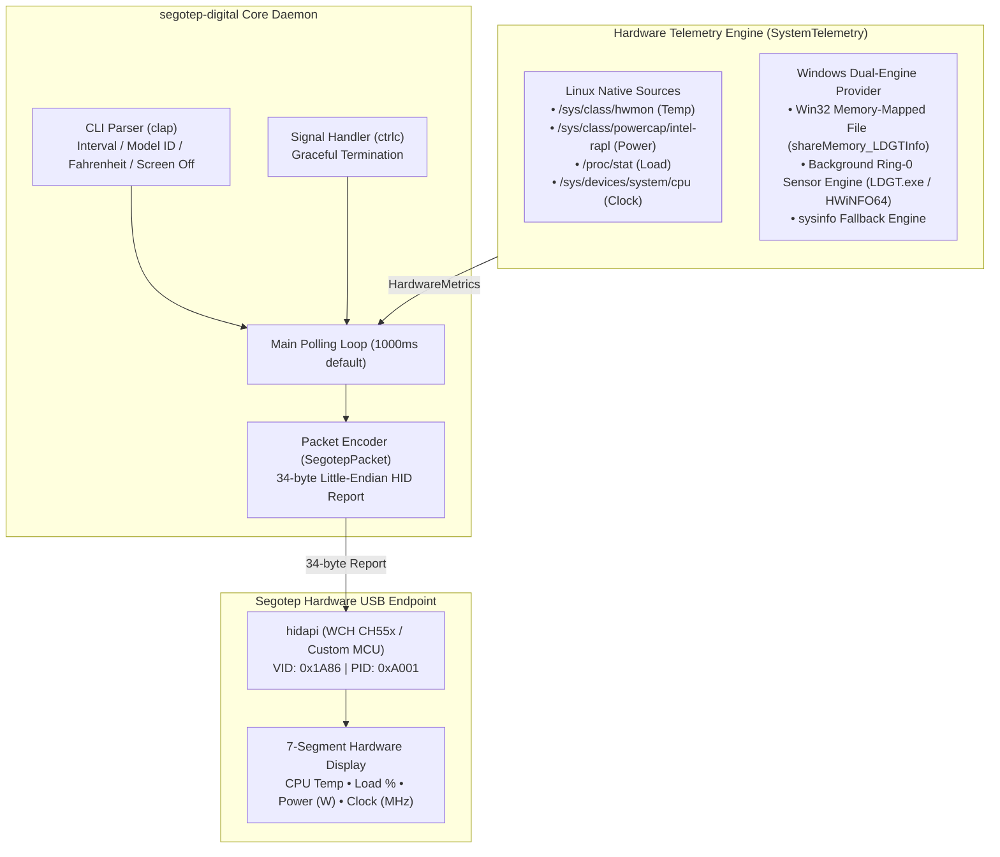
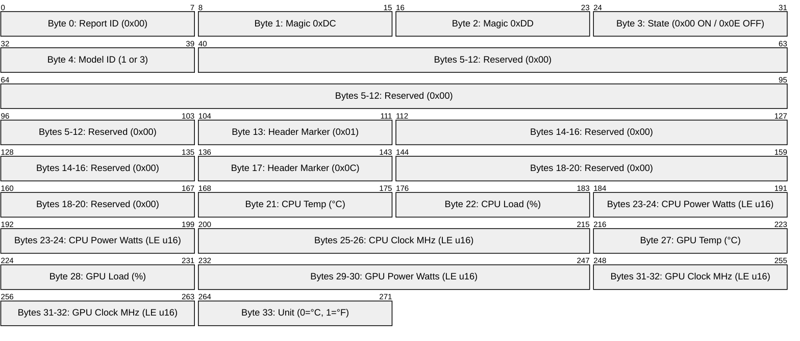
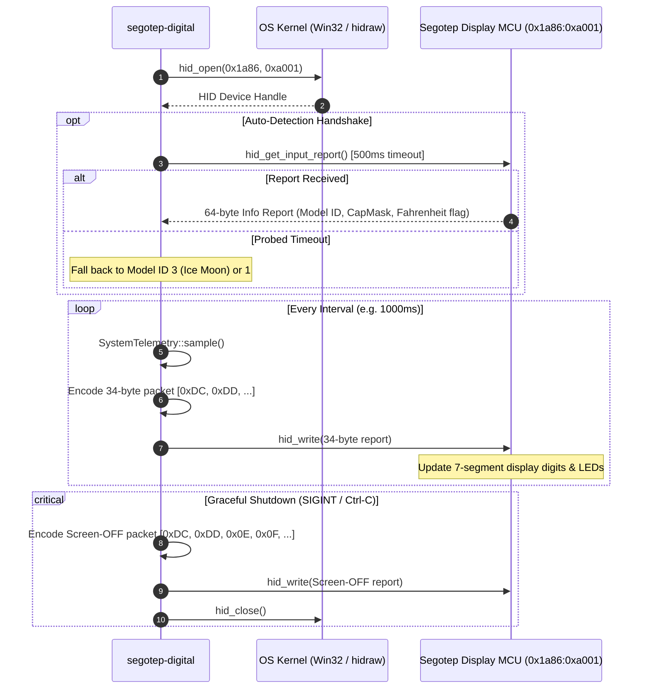
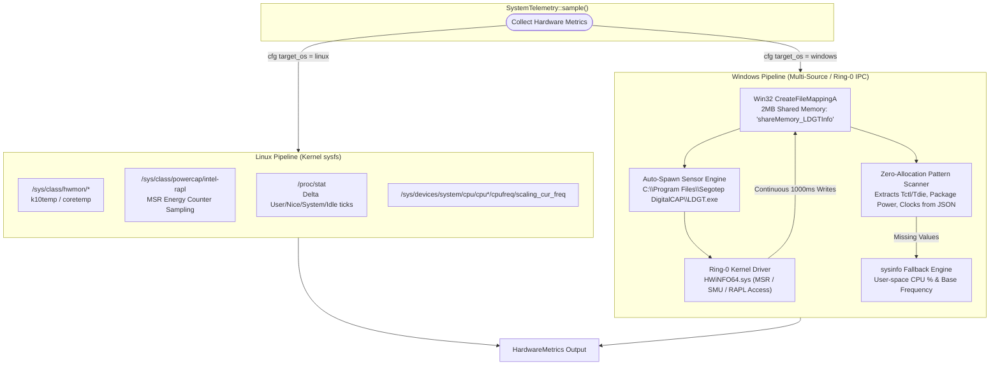
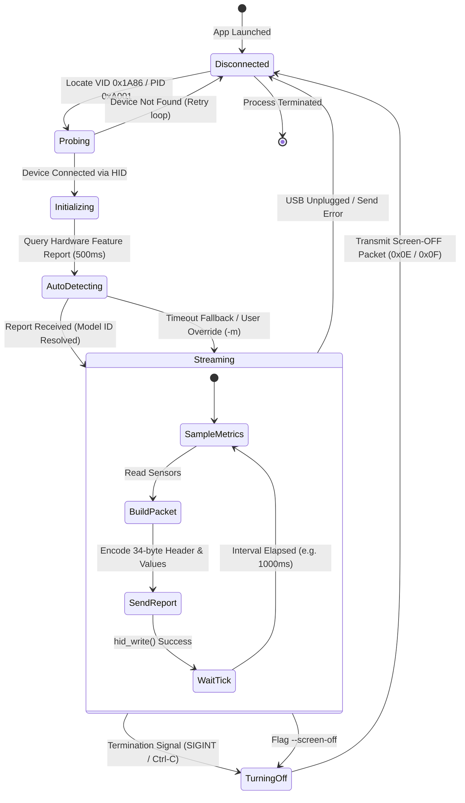

# Architecture & Technical Design

This document describes the internal architecture, cross-platform telemetry pipelines, reverse-engineered USB HID protocol, and hardware communication flow of `segotep-digital`.

---

## 1. High-Level System Architecture

`segotep-digital` is a lightweight, zero-overhead Rust daemon and CLI tool that drives Segotep Digital series AIO liquid cooler screens across both Linux and Windows.



---

## 2. Hardware USB HID Protocol & Packet Anatomy

The display communicates over USB HID (`VID: 0x1A86`, `PID: 0xA001`) via a fixed 34-byte output report sent at a regular polling interval (default: 1000ms).



### Protocol Flow & Handshake


---

## 3. Cross-Platform Telemetry Collection Pipeline

Getting precise CPU Package Power (Watts) and CPU Die Temperature (`Tctl/Tdie`) requires different approaches across operating systems due to kernel isolation:



---

## 4. Windows Shared Memory IPC & Sensor Engine Architecture

Because user-space Windows applications cannot read x86 MSR registers (like `MSR_RAPL_POWER_UNIT` `0x611` or AMD SMU Mailbox `0x3B10528`) without a Microsoft-attested Ring-0 driver, `segotep-digital` implements a zero-overhead shared memory bridge:

```mermaid
flowchart LR
    subgraph SegotepApp["segotep-digital (Rust Process)"]
        MAPPER["WindowsSharedMemoryReader"]
        PARSER["JSON Stream Pattern Parser"]
    end

    subgraph WinKernelMemory["Windows Kernel Shared Memory Bank"]
        MEM_BANK["shareMemory_LDGTInfo (2,097,152 Bytes)<br/>• Bank 0 (0..1MB): Sensor Registry & Active Values<br/>• Bank 1 (1MB..2MB): Alternate Double-Buffer Frame"]
    end

    subgraph SensorDriverEngine["Ring-0 Sensor Engine (LDGT.exe)"]
        ENGINE["LDGT Background Service"]
        RING0["HWiNFO64.sys Ring-0 Kernel Driver"]
        HARDWARE["Hardware Registers<br/>• AMD Ryzen SMU / Intel MSR RAPL (Power)<br/>• CPU Tctl/Tdie Sensors (Temperature)<br/>• GPU NVAPI / AMD ADL (GPU Stats)"]
    end

    MAPPER -->|1. CreateFileMappingA / MapViewOfFile| MEM_BANK
    MAPPER -->|2. Auto-Spawn (if not running)| ENGINE
    ENGINE -->|3. Loads Driver| RING0
    RING0 -->|4. Polls MSR/SMU Registers| HARDWARE
    HARDWARE -->|5. Raw Sensor Data| RING0
    RING0 -->|6. Writes Formatted JSON Buffer| MEM_BANK
    MEM_BANK -->|7. Zero-Copy Slice Scan| PARSER
    PARSER -->|8. Precision Metrics| MAPPER
```

---

## 5. Screen State Machine & Lifecycle

The display controller follows a robust state transition model to handle connection initialization, telemetry streaming, device disconnect/reconnect cycles, and clean screen power-off on shutdown:


