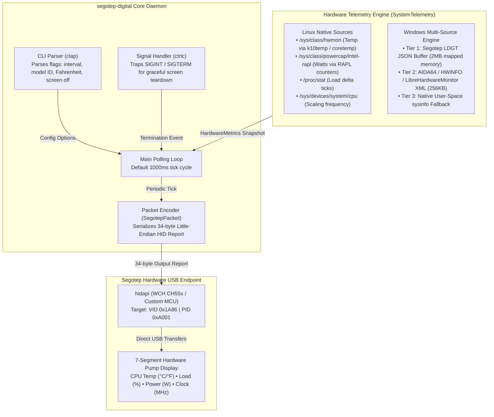
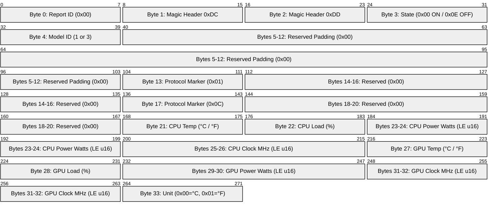
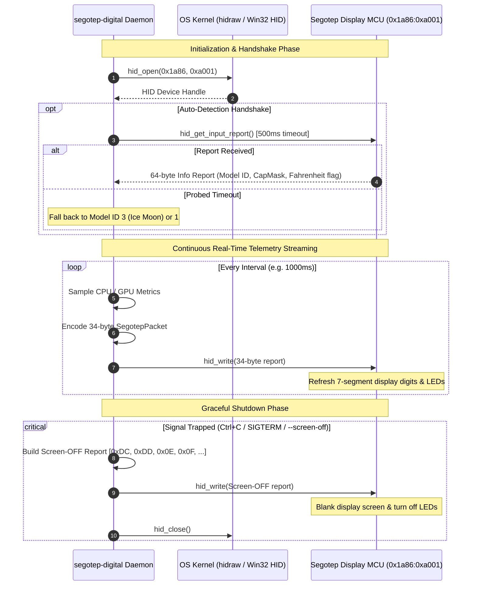
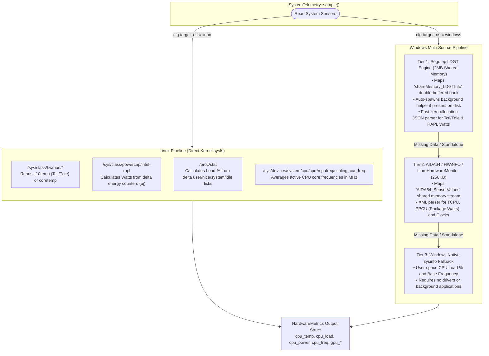
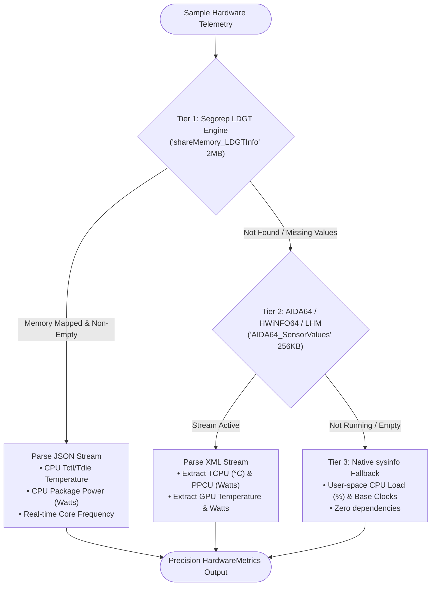
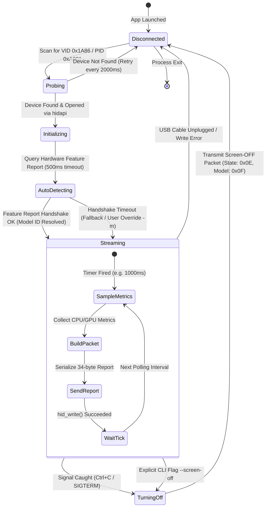

# Architecture & Technical Design

This document describes the internal architecture, cross-platform telemetry pipelines, reverse-engineered USB HID protocol, and hardware communication flow of `segotep-digital`.

---

## 1. High-Level System Architecture

`segotep-digital` is designed as a standalone, zero-overhead Rust daemon and CLI tool that drives Segotep Digital series AIO liquid cooler screens across both Linux and Windows without mandatory official desktop utilities.

### Flow Summary
1. **CLI & Signal Initialization**: The application parses command-line arguments (polling rate, model ID overrides, temperature units) and hooks OS termination signals (`Ctrl+C`, `SIGTERM`).
2. **Telemetry Sampling**: Every tick (default: 1000ms), `SystemTelemetry` samples CPU and GPU metrics via OS-specific pipelines.
3. **Packet Encoding**: Metrics are converted into a fixed 34-byte packet layout required by the Segotep microcontroller.
4. **HID Transmission**: The packet is transferred synchronously over USB HID to update the 7-segment display digits and status LEDs.

---

## 2. Hardware USB HID Protocol & Packet Anatomy

The display communicates over USB HID (`VID: 0x1A86`, `PID: 0xA001`) using a 34-byte output report.

### 34-Byte Packet Anatomy

### Key Field Descriptions
- **Magic Bytes (`0xDC 0xDD`)**: Required prefix for all valid command packets sent to the device.
- **State Byte (Index 3)**: `0x00` instructs the MCU to stay active and display incoming metrics; `0x0E` commands screen power down.
- **Model ID (Index 4)**: `1` for standard digital coolers; `3` for Ice Moon 360 series coolers.
- **Fixed Markers (`0x01` at index 13, `0x0C` at index 17)**: Protocol framing constants discovered through binary reverse engineering of the official driver.
- **16-bit Metric Encodings (Indices 23–26 & 29–32)**: Serialized as little-endian unsigned 16-bit integers (`u16`).

### Protocol Flow & Lifecycle Handshake

---

## 3. Cross-Platform Telemetry Collection Pipeline

Because user-space applications cannot read hardware MSR registers (such as AMD SMU power or Intel RAPL energy counters) the same way across operating systems, `segotep-digital` implements tailored OS telemetry backends.

### OS Implementation Differences
- **On Linux**: 100% native and driverless. The kernel provides unprivileged read access to thermal and powercap counters via `sysfs` (`/sys/class/hwmon` and `/sys/class/powercap/intel-rapl`).
- **On Windows**: Windows blocks direct user-space MSR access. The application executes a cascading 3-tier fallback to capture live die temperatures and wattage without hard dependencies on any single utility.

---

## 4. Windows Multi-Tier Sensor Engine Fallback

On Windows, hardware telemetry is evaluated in runtime tiers. The highest-fidelity active sensor source is chosen automatically:

### Fallback Tiers Explained
1. **Tier 1 (Segotep LDGT Shared Memory)**:
   - Allocates a 2MB double-buffered memory map (`shareMemory_LDGTInfo`).
   - Automatically detects and spawns `LDGT.exe` from `C:\Program Files\Segotep DigitalCAP\` or portable directory if present.
   - Extracts exact `CPU (Tctl/Tdie)` temperature, `CPU Package Power` (RAPL Watts), and core clocks from structured JSON.
2. **Tier 2 (AIDA64 / HWiNFO64 / LibreHardwareMonitor Shared Memory)**:
   - If the Segotep software is not installed, but the user has **AIDA64**, **HWiNFO64** (with shared memory enabled), or **LibreHardwareMonitor** running, the daemon attaches to `AIDA64_SensorValues` (256KB XML map).
   - Reads `TCPU`, `PCPU`, and clock nodes directly from shared memory.
3. **Tier 3 (Pure Standalone sysinfo)**:
   - If no Ring-0 hardware monitors are active, `segotep-digital` falls back to user-space `sysinfo`.
   - Continues driving CPU load percentage, core counts, and nominal clock speeds to the cooler without throwing errors or halting.

---

## 5. Screen State Machine & Lifecycle

The daemon maintains an explicit state machine to guarantee recovery from USB hot-unplugs and ensure screens are never left frozen with outdated values on exit:

### State Definitions
- **`Disconnected`**: Initial state before USB attachment or following a communication error / physical disconnect.
- **`Probing`**: Periodically checks connected HID device tables for Segotep hardware.
- **`Initializing`**: Establishes a handle via `hidapi` and sets up OS telemetry hooks.
- **`AutoDetecting`**: Attempts to read the device's capability header to resolve Model ID (1 vs. 3) automatically.
- **`Streaming`**: The active polling loop sending live 34-byte telemetry reports at the user-specified interval.
- **`TurningOff`**: Final graceful teardown state where a blanking packet (`0x0E 0x0F`) is transmitted to turn off LEDs and the 7-segment display.
