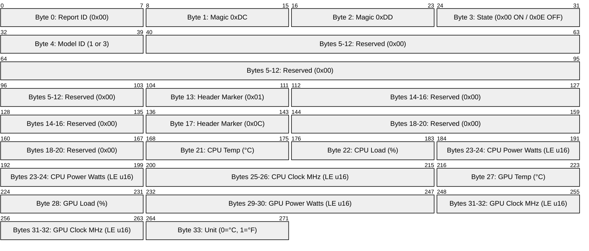
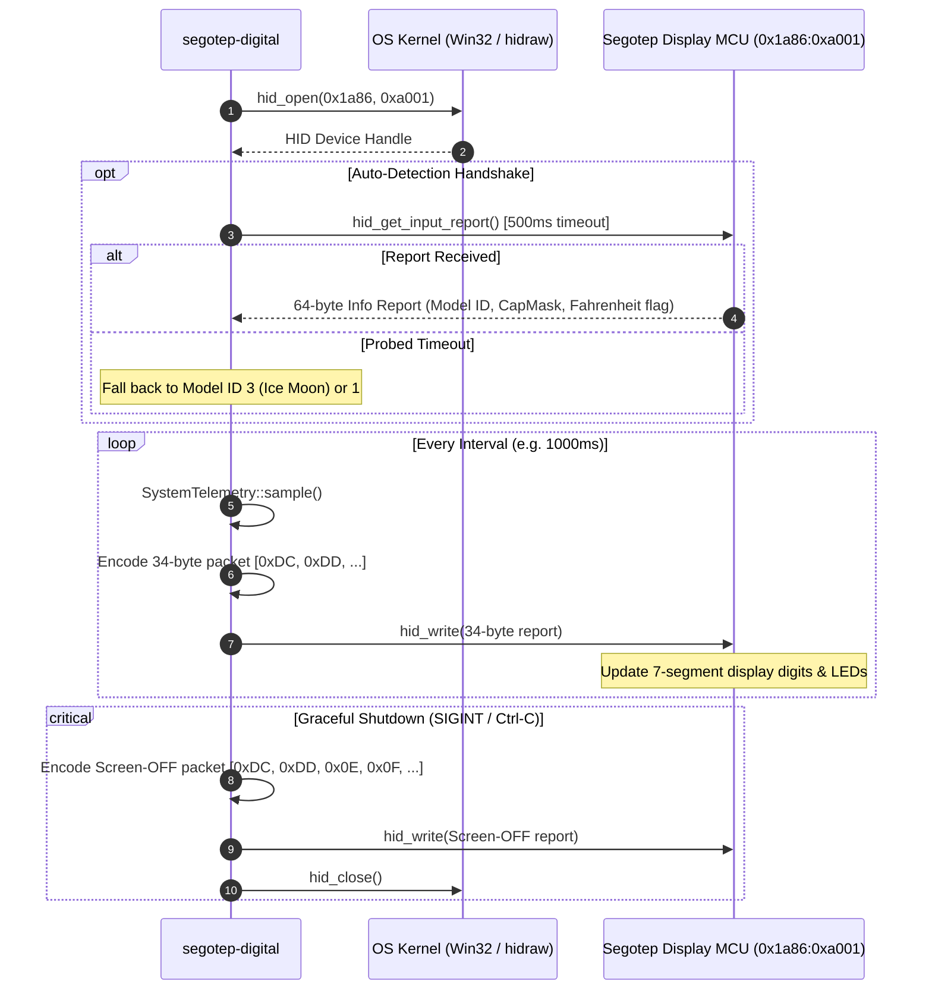
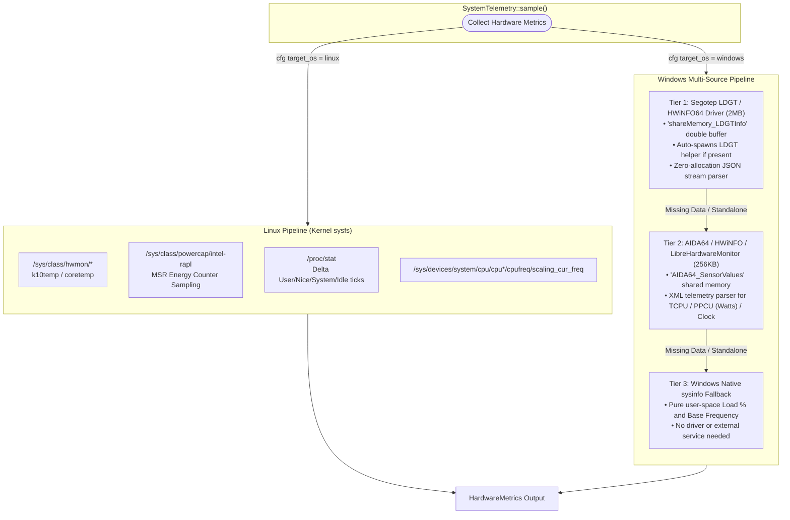
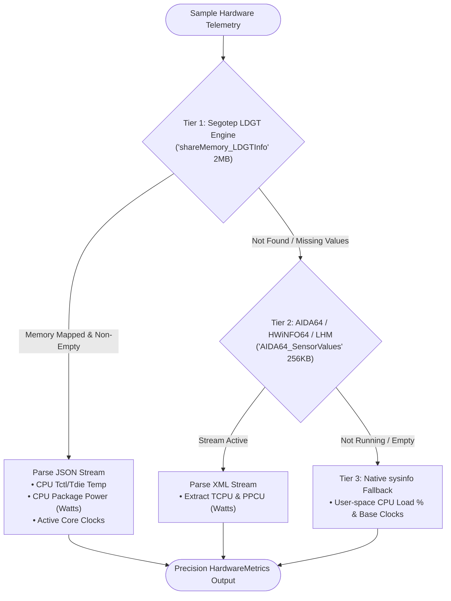
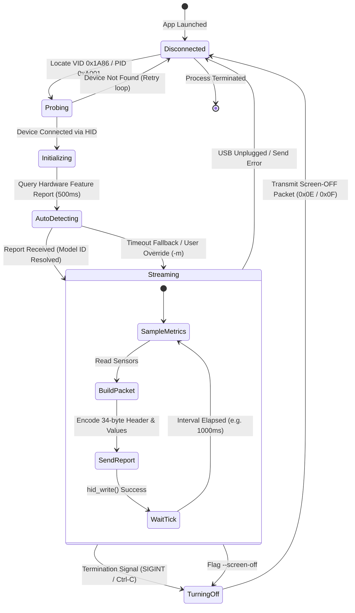

# Architecture & Technical Design

This document describes the internal architecture, cross-platform telemetry pipelines, reverse-engineered USB HID protocol, and hardware communication flow of `segotep-digital`.

---

## 1. High-Level System Architecture

`segotep-digital` is a lightweight, zero-overhead Rust daemon and CLI tool that drives Segotep Digital series AIO liquid cooler screens across both Linux and Windows.

---

## 2. Hardware USB HID Protocol & Packet Anatomy

The display communicates over USB HID (`VID: 0x1A86`, `PID: 0xA001`) via a fixed 34-byte output report sent at a regular polling interval (default: 1000ms).

### Protocol Flow & Handshake

---

## 3. Cross-Platform Telemetry Collection Pipeline

Getting precise CPU Package Power (Watts) and CPU Die Temperature (`Tctl/Tdie`) requires different approaches across operating systems due to kernel isolation:

---

## 4. Windows Multi-Tier Sensor Engine Fallback

Because reading CPU MSR power counters (`0x611`) and die temperatures on Windows requires Ring-0 kernel access, `segotep-digital` resolves hardware metrics through a clear multi-tier fallback pipeline:

---

## 5. Screen State Machine & Lifecycle

The display controller follows a robust state transition model to handle connection initialization, telemetry streaming, device disconnect/reconnect cycles, and clean screen power-off on shutdown:

