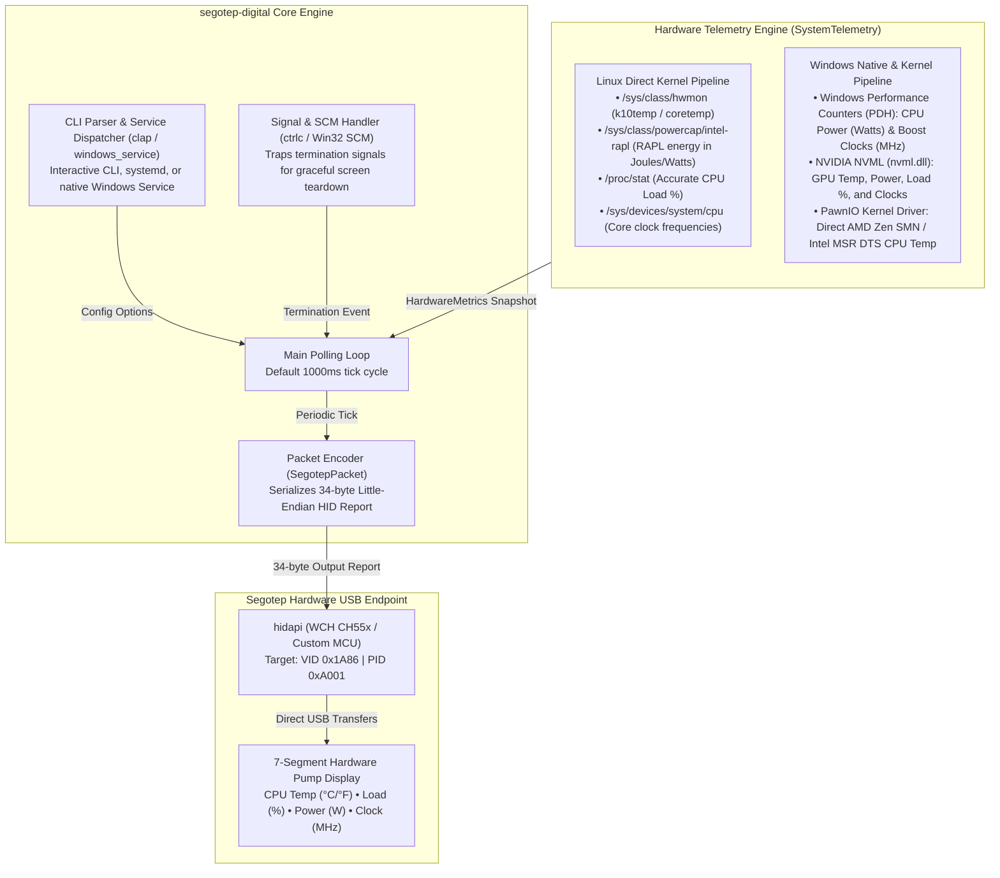
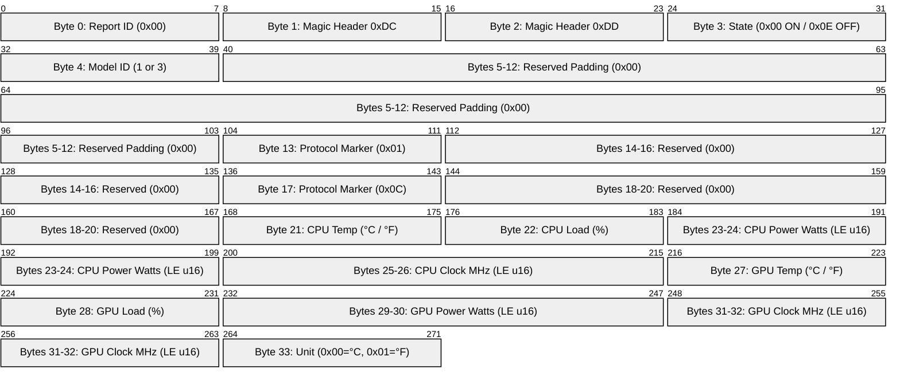
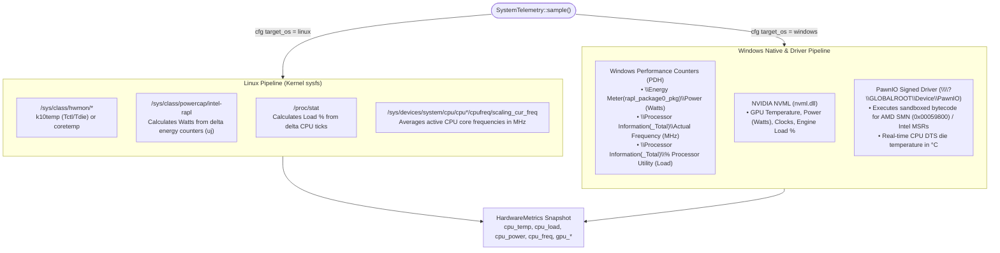
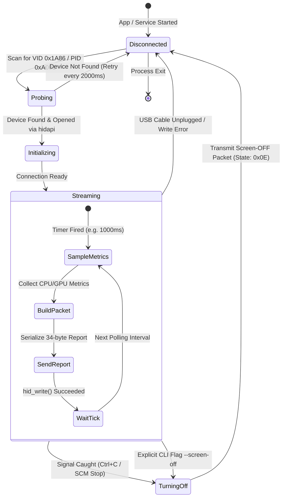

# Architecture & Technical Design

This document describes the internal architecture, cross-platform telemetry pipelines, reverse-engineered USB HID protocol, and hardware communication flow of `segotep-digital`.

---

## 1. High-Level System Architecture

`segotep-digital` is a standalone, 100% open-source Rust daemon and system service that drives Segotep Digital series AIO liquid cooler screens across Linux and Windows without proprietary vendor utilities.



### Flow Summary
1. **CLI & Service Dispatching**: Arguments are parsed to configure refresh rates, model ID overrides, and units. On Windows, the process can run interactively or dispatch directly through the Windows Service Control Manager (SCM).
2. **Telemetry Sampling**: Every tick (default: 1000ms), `SystemTelemetry` samples CPU and GPU metrics via OS-tailored pipelines.
3. **Packet Encoding**: Metrics are converted into the fixed 34-byte packet format expected by the Segotep display microcontroller.
4. **HID Transmission**: The packet is transferred synchronously over USB HID to refresh the 7-segment display digits and status indicators.

---

## 2. Hardware USB HID Protocol & Packet Anatomy

The display communicates over USB HID (`VID: 0x1A86`, `PID: 0xA001`) using a 34-byte output report.

### 34-Byte Packet Anatomy


### Key Field Descriptions
- **Magic Bytes (`0xDC 0xDD`)**: Required framing prefix for all valid command packets sent to the device.
- **State Byte (Index 3)**: `0x00` instructs the MCU to stay active and refresh digits; `0x0E` commands screen power down (blank digits and LEDs).
- **Model ID (Index 4)**: `1` for standard digital coolers; `3` for Ice Moon 360 series coolers. When the screen is OFF, this byte is overridden to `0x0F` (`FLASH_VALUE1_OFF`) instead of the model ID (see `src/protocol.rs`).
- **Fixed Markers (`0x01` at index 13, `0x0C` at index 17)**: Protocol framing constants discovered through reverse engineering.
- **16-bit Metric Encodings (Indices 23–26 & 29–32)**: Serialized as little-endian unsigned 16-bit integers (`u16`).

### Protocol Flow & Lifecycle Handshake
```mermaid
sequenceDiagram
    autonumber
    participant App as segotep-digital Daemon / Service
    participant OS as OS Kernel (hidraw / Win32 HID)
    participant MCU as Segotep Display MCU (0x1a86:0xa001)

    Note over App,MCU: Initialization Phase
    App->>OS: hid_open(0x1a86, 0xa001)
    OS-->>App: HID Device Handle

    Note over App,MCU: Continuous Real-Time Telemetry Streaming
    loop Every Interval (e.g. 1000ms)
        App->>App: Sample CPU / GPU Metrics
        App->>App: Encode 34-byte SegotepPacket
        App->>MCU: hid_write(34-byte report)
        Note over MCU: Refresh 7-segment display digits & LEDs
    end

    Note over App,MCU: Graceful Shutdown Phase
    critical Signal Trapped / Service Stop (Ctrl+C / SCM Stop / --screen-off)
        App->>App: Build Screen-OFF Report [0x00, 0xDC, 0xDD, 0x0E, 0x0F, ...]<br/>(Byte 0 = Report ID 0x00; Byte 3 = 0x0E OFF; Byte 4 = 0x0F override)
        App->>MCU: hid_write(Screen-OFF report)
        Note over MCU: Blank display screen & turn off LEDs
        App->>OS: hid_close()
    end
```

---

## 3. Cross-Platform Telemetry Collection Pipeline



---

## 4. Windows Telemetry Architecture: Open & Secure

### 1. Windows Performance Counters (PDH)
- Queries native Windows kernel performance objects via `pdh.dll`.
- Accurately captures live CPU package RAPL power consumption (Watts) and boosted clock frequencies across all physical/logical cores without high polling overhead.

### 2. NVIDIA NVML Dynamic Binding
- Dynamically loads `nvml.dll` at runtime if present on the system.
- Samples GPU temperature, core frequency, wattage, and utilization directly from the graphics driver.

### 3. Signed PawnIO Driver for Direct CPU Temperature
- Desktop motherboard UEFI implementations omit ACPI thermal zones, making user-space temperature queries impossible without kernel execution.
- `segotep-digital` embeds signed PawnIO bytecode modules (`AMDFamily17.bin`, `IntelMSR.bin`).
- Communicates directly with the kernel device handle `\\?\GLOBALROOT\Device\PawnIO` to query the AMD System Management Unit (SMU) thermal register `0x00059800` (or Intel digital thermal MSRs), providing true hardware die temperature with zero third-party GUI applications required.

---

## 5. Screen State Machine & Lifecycle

The daemon maintains an explicit state machine to guarantee recovery from USB hot-unplugs and ensure screens are never left frozen with outdated values on exit:


